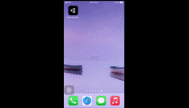

# Ball Launcher
A mini game where you have to destroy a tower using balls. This game is adapted to mobiles and supports the use of the TouchScreen as well as MultiTouch (use of several fingers).

I made this game during the Udemy course called "[Unity C# Mobile Game Development - Make 3 Games From Scratch](https://www.udemy.com/course/unity-mobile/)".

## Motivation
I wanted to review my basics, adapt my knowledge of game programming to mobile game programming so that I could then create my own games later.

## Preview

## Tech used
<b>Built with</b>
- Unity 2020.3
- C#

## What I learnt
- Get touch inputs from the device
- A bit of Unity 2D Physics
- Distinguish WorldSpace vs ScreenSpace
- Using Spring Joint
- Dynamic Resolution Scaling
- Building on Android / IOS
- Multi touch

## Features
- Drag a ball with one or more fingers and release it to destroy the tower
- Ball respawns every seconds

## Installation
1. Download this github project
1. Install Unity Hub
2. On Unity Hub install Unity 2020.3

## How to use?
1. After downloading this project, extract the archive to get the game folder
2. Open Unity Hub and click on the Open button to open the game folder
3. Once the game is loaded, click on the Play button to test the game with your mouse
4. If you want to test the game on mobile, you will have to build it yourself